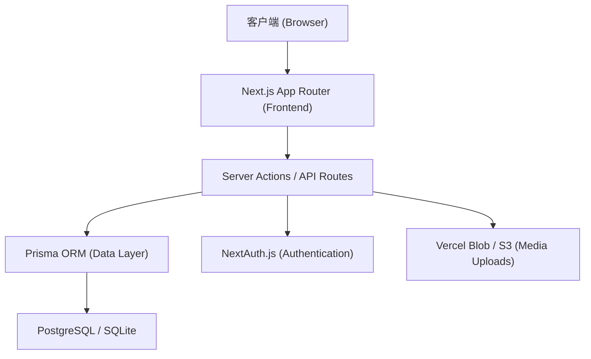
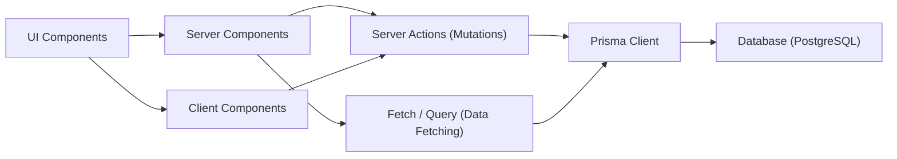
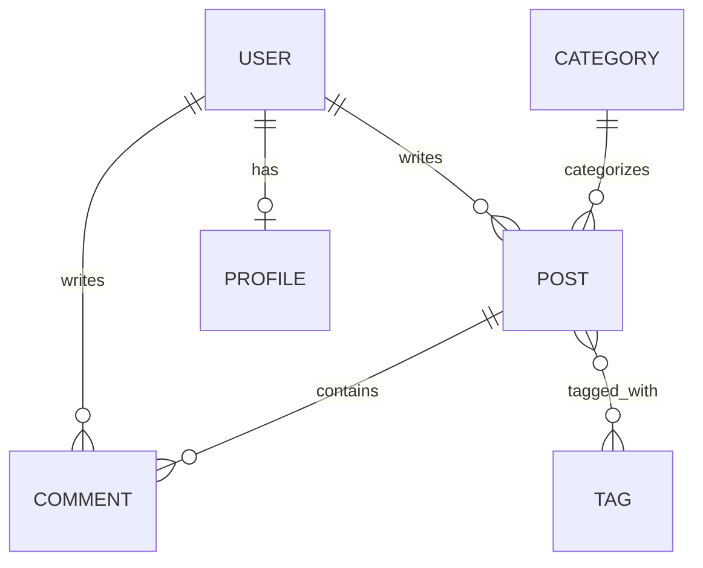

## 1. 架构设计


## 2. 技术描述
我们将从原本的 Django 全栈转向全栈 Next.js：
- **核心框架**: React@18 + Next.js (App Router) + TypeScript
- **样式方案**: TailwindCSS + class-variance-authority + clsx + tailwind-merge
- **动画库**: Framer Motion (页面过渡、微交互)
- **图标库**: Lucide React / Heroicons
- **组件库**: Radix UI (Headless UI) / shadcn/ui
- **数据层**: Prisma ORM
- **身份验证**: NextAuth.js v5 (Auth.js) 支持账号密码或 OAuth
- **富文本/Markdown**: react-markdown, remark-gfm, rehype-highlight
- **图片上传**: 整合云存储或本地 API 接收头像上传

## 3. 路由定义
| 路由 | 目的 |
|-------|---------|
| `/` | 首页（全站最新文章瀑布流，Hero 区，侧边栏分类标签） |
| `/login` | 登录页面（炫酷的左右分屏/毛玻璃表单） |
| `/register` | 注册页面 |
| `/post/[slug]` | 文章详情页（动态 SSG/ISR 生成，评论区互动） |
| `/post/new` | 发布新文章页面（全屏编辑体验，分步向导式或左右分栏） |
| `/post/[id]/edit` | 文章编辑页 |
| `/profile` | 个人中心（用户资料、发文数据、修改头像） |
| `/admin` | 管理员控制台（文章审核、评论管理、标签管理） |

## 4. API 定义 (Server Actions & API Routes)
- `login(credentials)` / `register(user)`: NextAuth 凭证登录。
- `createPost(data)`, `updatePost(id, data)`: 创建与更新文章，通过 Server Action 进行 revalidatePath 刷新缓存。
- `uploadAvatar(formData)`: 上传头像，返回图片 URL 供 Prisma 更新 Profile。
- `createComment(postId, content)`: 提交评论，默认状态为 `PENDING`。
- `approveComment(id)` / `rejectComment(id)`: 管理员操作，触发重新生成页面。
- `getPendingCommentsCount()`: 全局导航栏通知角标数据。

## 5. 服务器架构图


## 6. 数据模型 (Prisma Schema)
我们使用 Prisma Schema 重建原本的 Django 模型，保留所有业务逻辑（文章、分类、评论、标签、用户、资料）：

### 6.1 数据模型定义


### 6.2 Prisma Data Definition Language
```prisma
generator client {
  provider = "prisma-client-js"
}

datasource db {
  provider = "postgresql" // 本地开发可切换为 sqlite
  url      = env("DATABASE_URL")
}

model User {
  id        String    @id @default(cuid())
  username  String    @unique
  email     String?   @unique
  password  String
  role      Role      @default(USER)
  createdAt DateTime  @default(now())
  profile   Profile?
  posts     Post[]
  comments  Comment[]
}

enum Role {
  USER
  ADMIN
}

model Profile {
  id        String  @id @default(cuid())
  avatarUrl String?
  bio       String?
  userId    String  @unique
  user      User    @relation(fields: [userId], references: [id], onDelete: Cascade)
}

model Category {
  id        String   @id @default(cuid())
  name      String
  slug      String   @unique
  createdAt DateTime @default(now())
  posts     Post[]
}

model Tag {
  id        String   @id @default(cuid())
  name      String
  slug      String   @unique
  posts     Post[]   @relation("PostTags")
}

model Post {
  id          String    @id @default(cuid())
  title       String
  slug        String    @unique
  excerpt     String?
  content     String
  status      PostStatus @default(DRAFT)
  createdAt   DateTime  @default(now())
  updatedAt   DateTime  @updatedAt
  publishedAt DateTime?
  authorId    String
  categoryId  String?
  author      User      @relation(fields: [authorId], references: [id])
  category    Category? @relation(fields: [categoryId], references: [id], onDelete: SetNull)
  comments    Comment[]
  tags        Tag[]     @relation("PostTags")
}

enum PostStatus {
  DRAFT
  PUBLISHED
}

model Comment {
  id        String        @id @default(cuid())
  content   String
  status    CommentStatus @default(PENDING)
  createdAt DateTime      @default(now())
  postId    String
  userId    String
  post      Post          @relation(fields: [postId], references: [id], onDelete: Cascade)
  user      User          @relation(fields: [userId], references: [id], onDelete: Cascade)
}

enum CommentStatus {
  PENDING
  APPROVED
  HIDDEN
}
```
