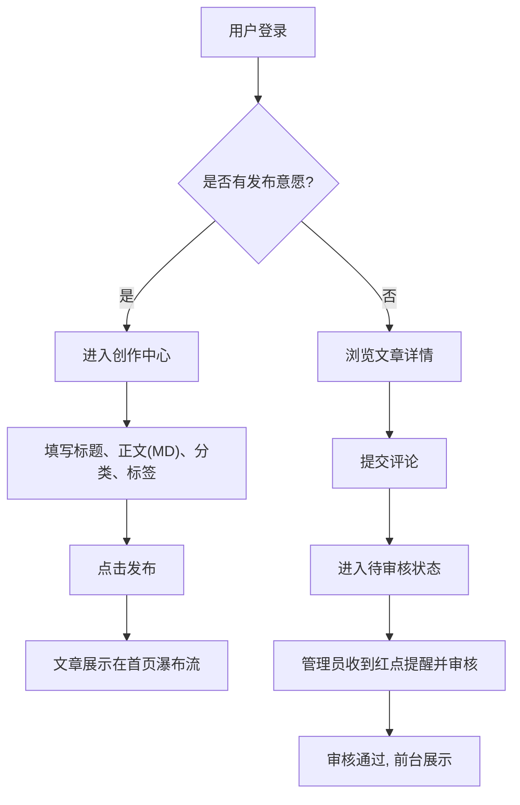

## 1. 产品概述
使用 Next.js + React 进行彻底重构的新版“纸上博客”。
- **主要目的**：将现有的传统 Django 博客应用，升级为具备现代化交互体验、极具设计感与视觉冲击力的前沿单页/全栈应用。保留核心业务逻辑，大幅度提升“炫酷”与“漂亮”的美学属性。
- **目标价值**：提供更流畅无刷新的阅读体验，并结合 Framer Motion 增加动态微交互、高级排版、沉浸式界面，让每一次阅读与写作都成为一种享受。

## 2. 核心功能

### 2.1 用户角色
| 角色 | 注册方式 | 核心权限 |
|------|---------------------|------------------|
| 普通用户 | 账号密码注册 | 浏览文章、发表评论、发布自己的文章、管理个人资料（头像） |
| 管理员 | 首个注册自动成为或由系统指派 | 拥有普通用户权限，外加审核他人评论、管理全站文章/分类/标签的权限 |

### 2.2 功能模块
1. **首页 (Home)**：高视觉冲击力的 Hero 区域（动态效果、视差滚动），文章瀑布流，全站搜索，精选分类。
2. **文章详情页 (Post Detail)**：沉浸式阅读模式，大字号精致排版，Markdown 富文本渲染，标签分类展示，底部互动评论区。
3. **创作与编辑 (Editor)**：所见即所得/Markdown 实时预览编辑器，流畅的发布交互体验。
4. **个人中心 (Profile)**：用户头像上传（动态预览），我的文章列表统计与快捷管理入口，管理员专属待办审核红点提示。

### 2.3 页面详情
| 页面名称 | 模块名称 | 功能描述 |
|-----------|-------------|---------------------|
| 首页 | 头部 Hero | 动态毛玻璃背景或几何渐变，醒目的引导文案，一键开始写作按钮 |
| 首页 | 文章列表 | 悬浮卡片式设计，鼠标 Hover 带有轻微放大与光晕效果，异步分页或无限滚动 |
| 文章详情 | 内容区 | 优秀的衬线体与非衬线体混排，代码高亮，阅读进度条 |
| 文章详情 | 评论区 | 提交评论无刷新即时反馈，评论列表按时间轴展现，管理员可在此直接快捷审核 |
| 创作中心 | 编辑表单 | 简洁全屏模式，输入时带有丝滑的过渡动画，支持多标签选择与分类绑定 |
| 个人中心 | 用户资料 | 圆形头像实时裁切上传，数据仪表盘（发文数、获赞数等），我的文章时间线展示 |

## 3. 核心流程
主要用户发文与评论流程：

## 4. 用户界面设计
### 4.1 设计风格 (Aesthetic Direction)
- **基调**：**现代精致、克制而又充满惊喜（Modern & Refined Minimalism with Maximalist Micro-interactions）**。拒绝千篇一律的后台管理界面感。
- **色彩与主题**：支持深色/浅色模式（Dark/Light Mode）。
  - **Light**：宣纸白（#F9F9F8）背景，墨黑（#111111）主字，点缀高饱和度的品牌色（如：赛博红或极光紫，用于按钮和 Hover 状态）。
  - **Dark**：深邃的磨砂黑（#0A0A0A），文字为暖灰（#EAEAEA），品牌色在暗色下带有发光（Glow）效果。
- **排版 (Typography)**：
  - 标题：采用无衬线几何字体（如 *Space Grotesk* 或 *Outfit*）或者优雅的衬线体组合，形成极强对比。
  - 正文：舒适的系统字体组合（Inter/Noto Sans SC 等），加大行高与段间距。
- **动效 (Motion)**：使用 Framer Motion 处理页面切换（Page Transitions）、卡片进入（Staggered Fade-in）、按钮点击涟漪效果（Ripple）以及滚动视差（Scroll Parallax）。

### 4.2 页面设计概览
| 页面名称 | 模块名称 | UI 元素及效果 |
|-----------|-------------|-------------|
| 全局 | 导航栏 | 滚动时玻璃态（Glassmorphism）吸顶，头像下拉菜单带弹性弹出版动画 |
| 首页 | Hero Banner | 文字逐行渐显（Staggered Text Reveal），背景带有缓慢流动的网格渐变（Mesh Gradient） |
| 首页 | 文章卡片 | 极简无边框设计，仅靠大面积阴影（Soft Shadow）和图片/色块区分，悬浮时轻微上浮（TranslateY） |
| 详情页 | 阅读区 | 极宽的留白（Negative Space），左侧悬浮点赞/分享栏，顶部带有随着滚动条加载的渐变进度条 |
| 个人中心 | 仪表盘 | 卡片式布局，大数字统计带有数字滚动动画（Number Ticker），头像上传带环形 Loading 动画 |

### 4.3 响应式策略
- 桌面端优先设计（Desktop-First），利用宽屏展示复杂的视差与悬浮组件。
- 移动端适配（Mobile-Adaptive），收起为底部导航或汉堡菜单，文章卡片转为通栏设计，保证触控区域（Touch Target）足够大。
