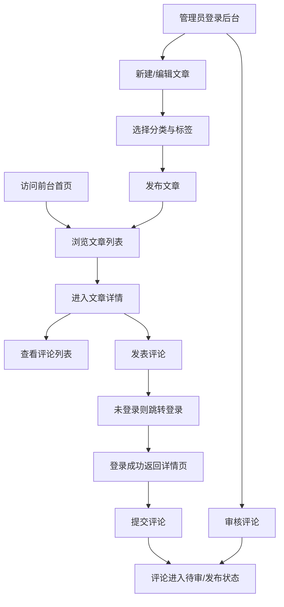

## 1. 产品概述
面向个人/小团队的 Web 端博客管理系统，提供前台文章阅读与评论互动，并提供后台可视化内容管理。
核心价值：用最小的运维成本快速搭建可公开访问的内容站点，支持持续发布与规范化运营。

## 2. 核心功能

### 2.1 用户角色
| 角色 | 注册方式 | 核心权限 |
|------|----------|----------|
| 游客 | 无 | 浏览文章、按分类/标签筛选、搜索、查看评论 |
| 注册用户 | 邮箱/用户名注册 | 登录、发表评论、管理自己的资料 |
| 管理员 | 后台创建/提权 | 文章/分类/标签/评论的增删改查、用户与权限管理、站点配置 |

### 2.2 功能模块
1. **前台首页**：站点导航、文章列表（分页）、推荐/最新、搜索入口
2. **文章详情页**：正文渲染、目录（可选）、标签/分类信息、评论列表与评论发布
3. **分类页/标签页**：按分类/标签聚合文章列表
4. **认证页**：注册、登录、退出、密码重置（可选）
5. **后台仪表盘**：内容概览、待审评论、快捷入口
6. **文章管理**：发布/草稿、富文本/Markdown 编辑、封面图（可选）、置顶（可选）
7. **分类管理**：分类增删改查、排序（可选）
8. **标签系统**：标签增删改查、文章多标签关联
9. **评论管理**：审核/屏蔽、反垃圾（可选）、删除/恢复（可选）
10. **权限管理**：用户、用户组、权限分配

### 2.3 页面明细
| 页面名称 | 模块名称 | 功能说明 |
|---------|----------|----------|
| 前台首页 | 文章列表 | 分页、按时间排序、摘要展示、快速跳转详情 |
| 前台首页 | 导航与搜索 | 站点导航、分类/标签入口、关键字搜索（标题/摘要/正文可选） |
| 文章详情 | 正文渲染 | 支持 Markdown 或富文本渲染、代码块样式优化 |
| 文章详情 | 评论区 | 列表、回复（可选）、发布（登录后）、审核（后台） |
| 分类页 | 分类聚合 | 展示分类信息与该分类下文章列表（分页） |
| 标签页 | 标签聚合 | 展示标签信息与该标签下文章列表（分页） |
| 注册 | 注册表单 | 用户名/邮箱/密码校验、重复检测、注册后登录（可选） |
| 登录 | 登录表单 | 用户名/邮箱 + 密码登录、记住我（可选） |
| 后台仪表盘 | 概览 | 文章数量、草稿数量、评论数量、待审数量 |
| 后台文章管理 | 编辑器 | 新建/编辑、草稿/发布、分类选择、标签输入、封面图（可选） |
| 后台分类管理 | 列表与编辑 | 增删改查、校验唯一性 |
| 后台标签管理 | 列表与编辑 | 增删改查、统计关联文章数 |
| 后台评论管理 | 审核流 | 审核通过/屏蔽/删除、按文章筛选 |
| 后台权限管理 | 用户与权限 | 用户、用户组、权限分配（使用框架内置机制） |

## 3. 核心流程
1. 游客访问首页 → 浏览文章列表 → 点击进入文章详情 → 查看评论。
2. 用户注册/登录 → 在文章详情页发表评论 → 评论进入“待审/已发布”（按站点策略）。
3. 管理员登录后台 → 新建文章草稿 → 选择分类与标签 → 发布 → 前台可见。
4. 管理员在后台审核评论 → 通过后前台展示，或屏蔽/删除。

## 4. 用户界面设计
### 4.1 设计风格
- 主色：深墨黑（#0B0F14）/纸张白（#F6F2E9）
- 强调色：朱砂红（#D6453D），用于按钮与交互高亮
- 字体：中文正文使用衬线风格（如 Noto Serif SC），标题使用更具编辑感的展示字体（如 ZCOOL XiaoWei / 思源宋体风格）
- 布局：桌面优先的杂志排版（宽留白、强调标题层级、卡片式列表）
- 组件风格：细边框、轻噪点背景（CSS）、按钮为“实心强调 + 轻微阴影”

### 4.2 页面设计概览
| 页面名称 | 模块名称 | UI 元素 |
|---------|----------|---------|
| 前台首页 | 文章卡片 | 大标题 + 摘要 + 元信息（日期/分类/标签），悬停边框高亮 |
| 文章详情 | 正文 | 宽行距、代码块高对比、目录吸顶（可选） |
| 文章详情 | 评论区 | 分层卡片、登录态提示、提交按钮高亮 |
| 后台 | 仪表盘 | 数据卡片 + 快捷入口，强调可读性与操作效率 |

### 4.3 响应式
- 桌面优先：≥1024px 使用双栏（正文 + 侧边栏）
- 平板：侧边栏下沉为折叠区
- 手机：单列、按钮与输入框加大触控面积、分页控件简化
