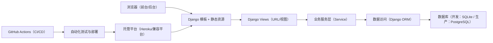
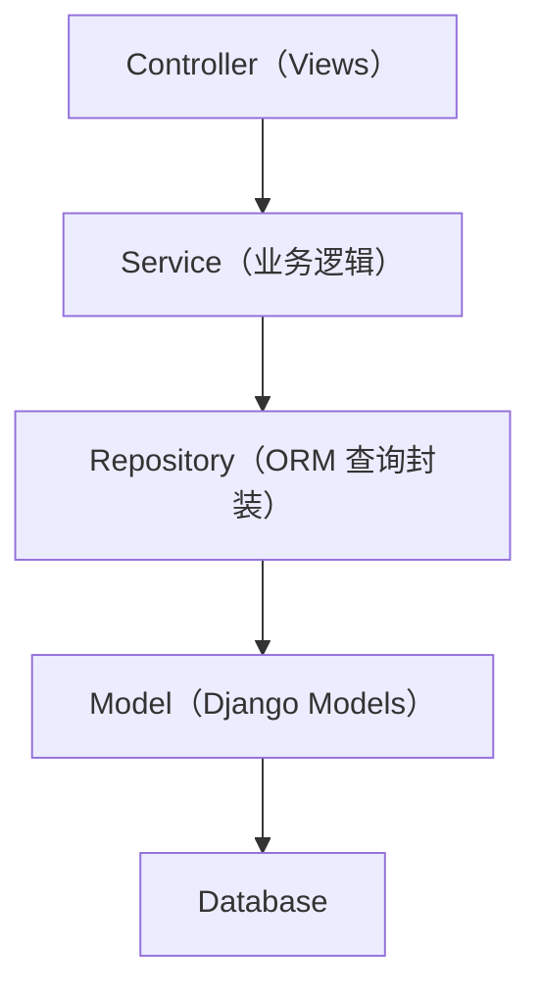
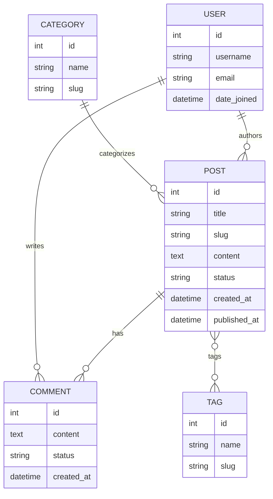

## 1. 架构设计

## 2. 技术说明
- 语言与运行时：Python（通过 runtime.txt 固定版本）
- Web 框架：Django（自带认证、管理后台、ORM 与迁移）
- WSGI：gunicorn
- 静态文件：WhiteNoise（生产环境直接由应用提供静态资源）
- 数据库：开发环境 SQLite；生产环境 PostgreSQL（平台注入 DATABASE_URL）
- 测试：Django TestCase + coverage（可选）
- 持续集成：GitHub Actions（自动安装依赖、运行测试、构建与部署）

## 3. 路由定义
| 路由 | 用途 |
|------|------|
| / | 前台首页（文章列表） |
| /post/<slug>/ | 文章详情与评论 |
| /category/<slug>/ | 分类聚合页 |
| /tag/<slug>/ | 标签聚合页 |
| /search/ | 搜索结果页 |
| /accounts/register/ | 注册 |
| /accounts/login/ | 登录 |
| /accounts/logout/ | 退出 |
| /admin/ | Django 管理后台 |
| /dashboard/ | 自定义后台（可选，若不使用纯 Django admin） |

## 4. API 定义（可选）
本系统以服务端渲染为主，不强制提供独立 REST API。若后续需要开放 API，可增加：
- /api/posts/（文章列表）
- /api/posts/<id>/（文章详情）
- /api/comments/（评论提交与审核）

## 5. 服务端分层图

## 6. 数据模型
### 6.1 数据模型定义

### 6.2 数据定义语言（参考）
以 Django 迁移为准；下述仅用于概念校验与索引规划参考：
- Post.slug、Category.slug、Tag.slug 建立唯一索引
- Comment.status、Post.status 建立普通索引
- Post 与 Tag 为多对多关系（中间表）
